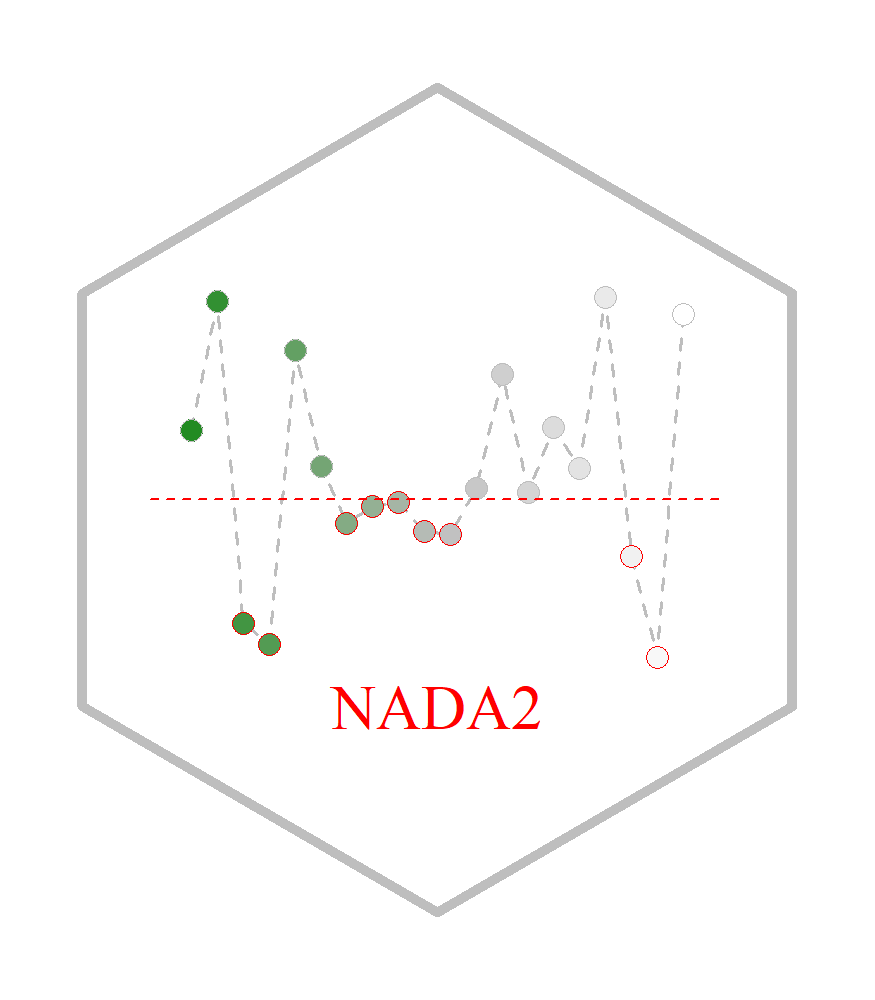

NADA2 
================

## Table of Contents

  - [Introduction](#intro)
  - [Citing package](#cite)
  - [Installation](#install)

## Introduction <a name="intro"></a>

For many environmental professionals, the way to deal with “nondetects”
is less than obvious. Values below detection or reporting limits result
from measuring trace amounts of a variety of organic and inorganic
chemicals. This package includes (maximum likelihood and survival
analysis) methods for computing summary statistics, hypothesis tests,
and regression for data with one or more detection limits.

This package is a series of new procedures and improvements on current
ones in the `NADA` package developed through a series of workshops and
updates to Helsel (2004).

  - Helsel, D.R., 2004. Nondetects and Data Analysis: Statistics for
    Censored Environmental Data, 1st edition. ed. Wiley-Interscience,
    Hoboken, N.J.

## Citing package <a name="cite"></a>

``` r
citation('NADA2')
```

    ## 
    ## To cite package 'NADA2' in publications use:
    ## 
    ##   Paul Julian and Dennis Helsel (2020). NADA2: Data Analysis for
    ##   Censored Environmental Data. R package version 0.1.0.
    ##   https://github.com/SwampThingPaul/NADA2
    ## 
    ## A BibTeX entry for LaTeX users is
    ## 
    ##   @Manual{,
    ##     title = {NADA2: Data Analysis for Censored Environmental Data},
    ##     author = {Paul Julian and Dennis Helsel},
    ##     year = {2020},
    ##     note = {R package version 0.1.0},
    ##     url = {https://github.com/SwampThingPaul/NADA2},
    ##   }

## Installation <a name="install"></a>

``` r
install.packages("devtools");# if you do not have it installed on your PC
devtools::install_github("SwampThingPaul/NADA2")
```

-----
